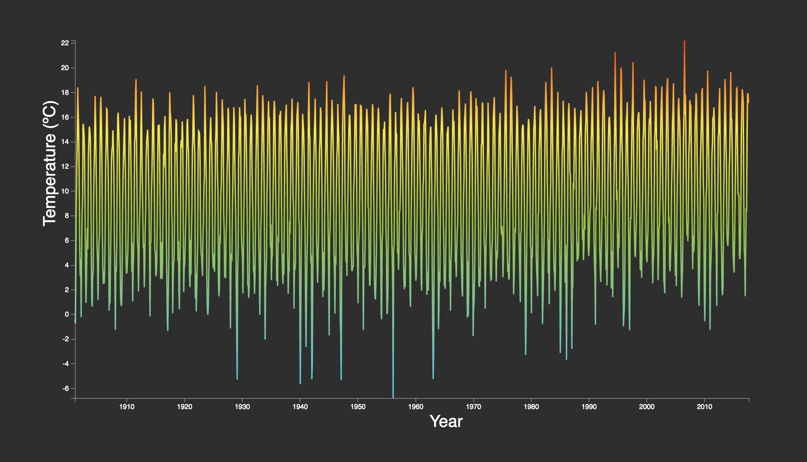

# [Assement 1](https://senpaizuri.github.io/fe3-assessment-1/)
For this first assesment I was tasked with handeling a dataset and making a visual of the data.



## Process
The process from point A to B.
### The Setup
The first thing I did was setting up and linking the basic files.
* index.html
* css/master.css
* js/main.js
* readme.md
* data.csv

I pulled the Temperature [data](https://github.com/cmda-fe3/course-17-18/blob/master/assessment-1/temperature.csv) and began working my magic.

### Choosing the Graph
When choosing my graph I had to skim through the data and look for a proper visualisation.
I had a look the pre-build [examples](https://github.com/d3/d3/wiki/Gallery) and the only graph that made sense at the time (It was late and I didn't read that well) was the [Bivariate Area Chart](https://bl.ocks.org/mbostock/3884914).
Only this morning I realised there also was a simple  [Line Chart](https://bl.ocks.org/mbostock/3883245). But by then it was already too late.
That evening I already rebuild the Bivariate chart into a Line Chart with common sense and a little bit of trial and error.

The example was build in D3 **v.3**. I first hooked up my own dataset and went bug-fixing. Since the code wasn't meant to handle de dataset I supplied I had to rewrite a few lines.

```Javascript
  //Example code
  var area = d3.svg.area()
      .x(function(d) { return x(d.date); })
      .y0(function(d) { return y(d.low); })
      .y1(function(d) { return y(d.high); });

  //Re:written code
  var
    path  = d3.line()
            .x(function(d) { return x(d.date) })
            .y(function(d) { return y(d.temp) })
```

Also, because the example was meant for 3 keys, I rewrote this code block;
```Javascript
  //Example Code
  d3.tsv("data.tsv", function(error, data) {
    if (error) throw error;

    data.forEach(function(d) {
      d.date = parseDate(d.date);
      d.low = +d.low;
      d.high = +d.high;
    });

    x.domain(d3.extent(data, function(d) { return d.date; }));
    y.domain([d3.min(data, function(d) { return d.low; }), d3.max(data, function(d) { return d.high; })]);

  //Re:written code
  d3.csv('data.csv', function(error, data) {
    if (error) throw error;

    data.forEach(function(d) {     
      if (d.date && d.temp) {     
        d.date = parseDate(d.date)  
        d.temp = +d.temp          
      }
    });
    x.domain(d3.extent(data, function(d) {
      return d.date;
     }))
    y.domain(d3.extent(data, function(d) {
      return d.temp
    }))
```
Whilst "fixing" the code i simultaneously refactored all of the deprecated code to **v.4**.

### The Fun Stuff

Now that the code was fully functioning and showing the data I wanted to pimp the graph with some animations and gradients.

For the gradients I made a **Hue** object. This stores the prefered colors for the gradient. Later in the code a loop is fired to make the svg gradient working. Svg gradients work diffrently then most so I found a solution and implemented it. 
```Javascript
//Extra code to get the gradient effect and animation working

//Line 14
var
  hue =[                      
        {
          'color':'#5BC0EB',
          'stop':'0%'
        },
        {
          'color':'#9BC53D',
          'stop':'50%'
        },
        {
          'color':'#FDE74C',
          'stop':'75%'
        },
        {
          'color':'#F34213',
          'stop':'100%'
        }
      ]
      
//Line 61
svg.append('defs')
    .append('linearGradient') 
      .attr('x1', '0%')       
      .attr('y1', '100%')     //Defines the direction of the gradient we're about to make
      .attr('x2', '0%')
      .attr('y2', '0%')
      .attr('id','gradient')  //Lets the element fill the gradient we're about to make

  hue.forEach(function(c){      //Runs loop forEach block in the hue object so that every color is displayed
    d3.select('svg').select('linearGradient') //Selects the desired element
      .append('stop')           //Appends the stop to the linearGradient to get that juicy gradient
        .attr('offset', c.stop) //Sets the offset for the color
        .attr('style','stop-color:'+c.color+';stop-opacity:1')  //Sets the stopcolor and opacity
  })
  
//line 86
animate() //Now the path exists run the animate function
  
//line 112
function animate(){ //Creating a animation function, Toggles a class which starts the animation
  var
    line       = document.querySelector('#line'),
    lineLength = line.getTotalLength()

    line.style.strokeDasharray =
    line.style.strokeDashoffset = lineLength  //Set the strokeDasharray and offset to it's own length to display it 'outofbounds'

    setTimeout(function(){  //Toggle the animation a tat later to avoid loading weirdness
      line.classList.add('animateLine')
      line.style.strokeDashoffset = 0
    },250)
}
```
To animate the chart I also wrote 3 lines of css.
```CSS3
.animateLine{
  transition: 10s all ease;
}
```
.
And that's how I made the [assesment](https://senpaizuri.github.io/fe3-assessment-1/).

## Features
*  [D3 Time](https://github.com/d3/d3/blob/master/API.md#time-formats-d3-time-format)       - https://github.com/d3/d3/blob/master/API.md#time-formats-d3-time-format
*  [D3 Shapes](https://github.com/d3/d3/blob/master/API.md#shapes-d3-shape)     - https://github.com/d3/d3/blob/master/API.md#shapes-d3-shape
*  [D3 Scale](https://github.com/d3/d3/blob/master/API.md#scales-d3-scale)     - https://github.com/d3/d3/blob/master/API.md#scales-d3-scale
*  [D3 Axis](https://github.com/d3/d3/blob/master/API.md#axes-d3-axis)     - https://github.com/d3/d3/blob/master/API.md#axes-d3-axis
*  [D3 Selections](https://github.com/d3/d3/blob/master/API.md#selections-d3-selection)     - https://github.com/d3/d3/blob/master/API.md#selections-d3-selection

## Resources
*  [Area Chart](https://bl.ocks.org/mbostock/3884914)    - https://bl.ocks.org/mbostock/3884914
*  [Gradients](https://www.w3schools.com/graphics/svg_grad_linear.asp)     - https://www.w3schools.com/graphics/svg_grad_linear.asp
*  [Domain&Extent](http://www.d3noob.org/2012/12/setting-scales-domains-and-ranges-in.html) - http://www.d3noob.org/2012/12/setting-scales-domains-and-ranges-in.html
*  [Lines](https://www.dashingd3js.com/svg-paths-and-d3js)  - https://www.dashingd3js.com/svg-paths-and-d3js

## License

MIT - 2017 Maikel Sleebos
